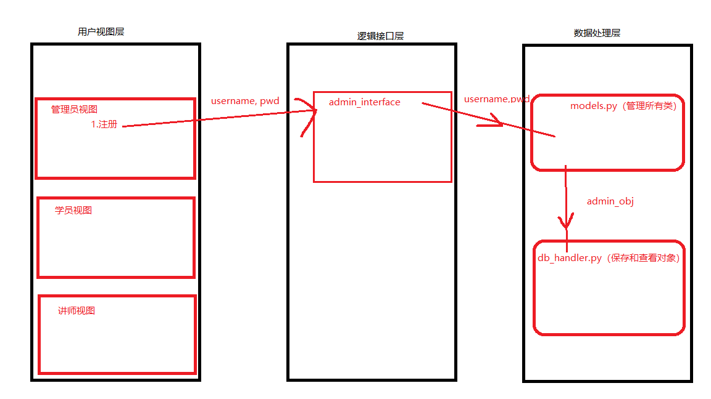

# 需求
    - 角色:学校、学员、课程、讲师、管理员
    - 创建北京、上海两所学校
    - 创建python、go两门课程，python在北京开,go在上海开
        - 通过学校创建课程 
    - 创建讲师
    - 学员可以选择学校，关联课程
    - 提供三个角色接口
        - 学员视图，可以注册，选择课程，查看课程分数等
        - 讲师视图，讲师可管理自己的课程，上课时选择课程，查看课程学员列表，修改所管理的学员的成绩等
        - 管理视图，创建讲师，创建课程等
    - 使用登录认证装饰器，未登录不用允许使用功能
    - 使用面向对象程序设计，操作产生的数据都通过pickle序列化保存到文件里

# 本程序说明
    - 管理员：用户名：root  密码：root
    - 老师： 用户名：tacher 密码：123
    - 学生： 用户名：lili   密码：lili
            用户名：bd     密码：bd
            用户名：st     密码：st
    - 学校： 名称：qh       地址：bj
            名称：fd       地址：sh
    - 课程： python，go
    - 其中lili选择了qh学校，qh有python课程，
          bd和st选择了fd学校，fd有go课程
          teacher老师同时教python和go两门课程
          lili和bd和fd的课程分数都被teacher老师修改为了100分

# 一、需求分析
    - 管理员视图
        - 1.注册
        - 2.登录
        - 3.创建学校
        - 4.创建课程（先选择学校）
        - 5.创建讲师
    - 学员视图
        - 1.注册
        - 2.登录功能
        - 3.选择校区
        - 4.选择课程（先选择校区，再选择校区中的某一门课程）
            - 学生选择课程，课程也选择学生
        - 5.查看分数
    - 讲师视图
        - 1.登录
        - 2.查看教授课程
        - 3.选择教授课程
        - 4.查看课程下的学生
        - 5.修改学生分数

# 二、程序的架构设计
    - 三层架构
        - 用户视图层
            - core
                - src.py        主视图
                - admin.py      管理员视图
                - student.py    学生视图
                - teacher.py    讲师视图
        - 逻辑接口层
            - interface
                - admin_interface.py
                - student_interface.py
                - teacher_interface.py
        - 数据处理层
            -db
                - models.py         管理所有类
                - db_handler.py     查看保存pickle后的对象数据

# 三、分任务开发
# 四、测试
# 五、上线
